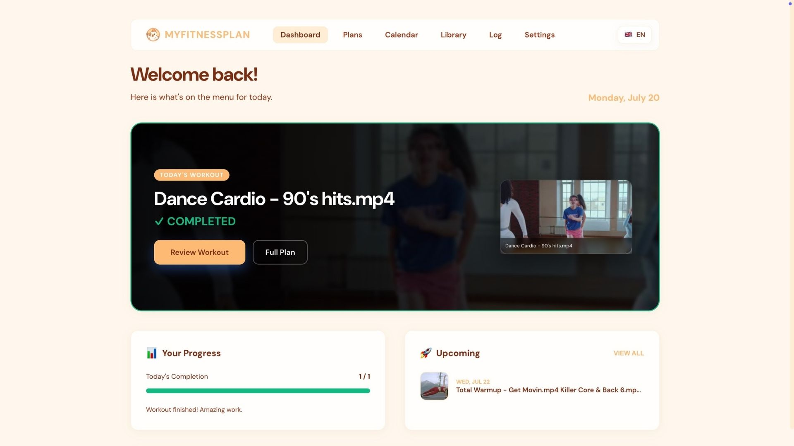

🇬🇧 English: [README.md](README.md)

<p align="center">
  
</p>
<h1 align="center">MyFitnessPlan - Open Source Self-Hosted Home Video Workout Planner</h1>


Samodzielnie hostowana lokalna aplikacja do zarządzania własnymi planami treningowymi z elastycznymi schematami harmonogramów opartymi na Twojej własnej kolekcji wideo.

MyFitnessPlan to osobiste narzędzie do planowania treningów stworzone z myślą o organizowaniu i śledzeniu rutyn treningowych przy użyciu kolekcji własnych materiałów wideo. W przeciwieństwie do sztywnych, tygodniowych harmonogramów, MyFitnessPlan pozwala definiować własne schematy treningowe dopasowane do Twojego stylu życia — niezależnie od tego, czy jest to 3 dni treningu i 1 dzień przerwy, czy dowolny inny układ.

- **Strona internetowa**: [myfitnessplan.bigdeckit.com](https://myfitnessplan.bigdeckit.com) — staram się ją aktualizować na bieżąco, to najprostszy sposób, żeby zobaczyć, jak to działa
- **Pobieranie**: pobierz najnowszy instalator macOS `.dmg` lub Windows `.exe` ze strony [Releases](https://github.com/Klodizaur/MyFitnessPlan/releases). Nie potrzebujesz Node.js, npm ani terminala.

## Funkcje

### Import treningów z arkuszy kalkulacyjnych


Łatwo importuj całą swoją bibliotekę treningów za pomocą prostych plików TSV lub CSV — kompatybilnych z Excel, Google Sheets i innymi programami do arkuszy kalkulacyjnych. Panel od razu pokazuje, co zaimportowałeś: dzisiejszy trening i to, ile z niego już ukończono.

### Zarządzanie i tworzenie wielu planów


Wgraj gotowy plan albo zbuduj go od zera, dzień po dniu, tydzień po tygodniu, bezpośrednio z biblioteki wideo. Trzymaj kilka planów naraz i przełączaj się między nimi — albo uruchom dwa jednocześnie: **plan główny** razem z **planem dodatkowym** (np. krótki blok mobility lub core), bez zastępowania jednego drugim.

### Elastyczne, własne schematy


Brak sztywno zakodowanych dni tygodnia. Zdefiniuj własny schemat treningowy — 3 dni treningu / 1 dzień przerwy, 5 dni treningu / 2 dni przerwy lub dowolny inny cykl — a kalendarz podąży za nim zamiast za tygodniem kalendarzowym.

### Widoki kalendarza


Przeglądaj harmonogram jako klasyczną listę kart, suwak lub nowszy widok **Day Tape** — poziomy pasek dni pogrupowanych tygodniami, z kropką oznaczającą dni treningowe, rozwijający się w pełny widok szczegółów z miniaturką, czasem trwania i tagami. Potrzebujesz przerwy? Zamroź jeden dzień lub cały odcinek bez utraty żadnego treningu — zamrożone dni pokazują powód zamiast treningu, a reszta planu przesuwa się dalej, robiąc na to miejsce.

### Wbudowany odtwarzacz z zapętlaniem i odpoczynkiem


Odtwarzaj filmy bez wychodzenia z aplikacji — obok nich widzisz cel treningu, potrzebny sprzęt, typ i intensywność. Odtwarzacz może zapętlić film na ustaloną liczbę powtórzeń z odpoczynkiem między każdym z nich, a także osobny, zwykle dłuższy odpoczynek przed kolejnym filmem w planie — koniec z sięganiem po pasek przewijania między rundami.

### Lokalna biblioteka wideo i filtrowanie


Wskaż MyFitnessPlan swoje lokalne foldery wideo, a aplikacja sama je zeskanuje i uporządkuje. Szukaj i filtruj według sprzętu, typu treningu, partii ciała lub intensywności, żeby znaleźć dokładnie to, czego potrzebujesz — bez przesyłania jakiegokolwiek pliku gdziekolwiek.

### Śledzenie postępów


Zobacz liczbę ukończonych treningów, aktywne dni i miesięczny kalendarz aktywności na pierwszy rzut oka. Oznaczaj pojedyncze ćwiczenia jako ukończone i śledź postęp każdej sesji treningowej — pełna elastyczność sposobu logowania treningów.

### Personalizacja i motywy


Dostosuj aplikację do siebie dzięki kilku wbudowanym motywom kolorystycznym — od Midnight i Forest po Pastel Pink i Sky Blue — a także preferencjom języka i układu kalendarza, wszystko w Ustawieniach.

### Dodatkowe funkcje
- **Zamrażanie planów bez utraty postępów**: zatrzymaj jeden dzień lub cały odcinek (choroba, wyjazd, cokolwiek) i każdy trening, który miał tam wypaść, po prostu przesuwa się na najbliższy wolny dzień
- **Lokalna i self-hosted**: działa całkowicie na Twoim komputerze bez zależności od chmury
- **Aplikacja desktopowa**: instalowalna aplikacja na macOS/Windows, która pakuje serwer i interfejs — bez potrzeby Node.js ani terminala (patrz [desktop/README.md](desktop/README.md))
- **Obsługa wielu języków**: dostępna po angielsku i polsku
- **Bez subskrypcji**: pełna kontrola nad Twoimi danymi i biblioteką treningów
- **Prywatność przede wszystkim**: wszystkie dane pozostają na Twoim komputerze

## Rozwój i wkład w projekt

Wszystko poniżej jest dla osób, które chcą uruchomić aplikację z kodu źródłowego, zbudować ją samodzielnie lub pomóc w jej rozwoju.

### Wymagania

- Node.js (v20 lub nowszy)
- npm

### Instalacja i uruchomienie lokalnie

1. **Sklonuj repozytorium**
   ```bash
   git clone <repository-url>
   cd <downloaded root folder>
   ```

2. **Zainstaluj zależności** (instaluje workspace'y `client` i `server`)
   ```bash
   npm install
   ```

3. **Uruchom aplikację**
   ```bash
   npm run dev
   ```
   Uruchamia to razem serwer (`http://localhost:3000`) i klienta Vite (`http://localhost:5173`).

4. **Otwórz przeglądarkę** pod adresem `http://localhost:5173`

### Samodzielne budowanie aplikacji desktopowej

Folder `desktop/` pakuje MyFitnessPlan do tego samego samodzielnego instalatora macOS `.dmg` lub Windows `.exe`, jaki jest publikowany na stronie Releases (narzędzia obsługują też build na Linuksa, ale nie jest on jeszcze publikowany). Instrukcje budowania i informacje o tym, gdzie przechowywane są dane, znajdziesz w [desktop/README.md](desktop/README.md).

## ⚠️ Ważna informacja

**MyFitnessPlan nie dostarcza żadnych filmów treningowych, treści ani ćwiczeń.** Użytkownik jest całkowicie odpowiedzialny za pozyskiwanie własnych materiałów wideo. Aplikacja służy wyłącznie do planowania i organizacji treningów. Upewnij się, że wszystkie wykorzystywane materiały są zgodne z prawem autorskim i warunkami korzystania z usług. Nie ponoszę odpowiedzialności za sposób używania aplikacji ani za treści pozyskiwane przez użytkownika.

## Dodawanie treningów

### Import plików TSV/CSV

MyFitnessPlan obsługuje masowy import treningów z plików TSV (Tab-Separated Values) lub CSV (Comma-Separated Values).

#### Przykładowe formaty treningów

W folderze `example_workout_sheets/` znajdują się dwa przykładowe pliki TSV.

**Opcja 1: Prosty format (jedno wideo na slot)**
- Plik: `Example workout plan - Simpler workout plan - one video per row.tsv`
- Najlepszy dla: prostych harmonogramów treningowych z jednym filmem na dzień/slot
- Struktura:
  - Pierwsza kolumna: identyfikator tygodnia
  - Pozostałe kolumny: sloty treningowe (Workout 1, Workout 2, itd.)
  - Wypełnij komórki nazwami treningów lub filmów
  - Puste komórki oznaczają dni odpoczynku

**Opcja 2: Format wielu wideo dziennie**
- Plik: `Example workout plan - Multi-video per day.tsv`
- Najlepszy dla: bardziej złożonych treningów z rozgrzewką, kilkoma ćwiczeniami i wyciszeniem
- Struktura:
  - Pierwszy wiersz: numer tygodnia i dni tygodnia (Mon, Tue, Wed, itd.)
  - Pierwsza kolumna: typ ćwiczenia (Warm up, Exercise 1, Exercise 2, itd.)
  - Każdy dzień ma własną kolumnę
  - Użyj „—” dla dni odpoczynku lub pustych slotów

#### Jak stworzyć własny plik treningowy

1. **Zacznij od przykładowego pliku** — pobierz jeden z przykładowych plików TSV z `example_workout_sheets/`

2. **Skorzystaj z asystenta AI** — wykorzystaj ChatGPT, Claude lub dowolne inne narzędzie AI:
   - Podziel się z AI strukturą przykładowego pliku
   - Podaj listę dostępnych filmów treningowych
   - Poproś AI o zachowanie dokładnie tej samej struktury i układu
   - Poproś AI o stworzenie planu treningowego dopasowanego do Twoich preferencji
   - Przykładowy prompt: *„Oto struktura pliku TSV [wklej format]. Mam dostępne te filmy treningowe [wymień je]. Stwórz 4-tygodniowy plan treningowy w tym formacie, z układem 3 dni treningu i 1 dzień przerwy w tygodniu."*

3. **Edytuj plik** — możesz też ręcznie edytować pobrany plik TSV w Excel, Google Sheets lub dowolnym edytorze tekstu

4. **Dostosuj harmonogram** — zmodyfikuj go pod swój preferowany schemat treningowy (3 dni treningu/1 dzień przerwy, 5/2 itd.)

#### Wymagania dotyczące plików

- Format pliku: `.tsv` (Tab-Separated Values) lub `.csv` (Comma-Separated Values)
- **Dopasowanie nazw plików wideo**: nazwy plików wideo muszą odpowiadać nazwom treningów w arkuszu lub być do nich bardzo podobne. Aplikacja używa tych nazw, żeby zlokalizować i połączyć filmy z odpowiednimi treningami. Na przykład, jeśli arkusz zawiera „30min Cardio Workout", plik wideo powinien nazywać się np. „30min Cardio Workout.mp4" lub „30min-Cardio-Workout.mp4"
- Odwołania do wideo: używaj rzeczywistych nazw swoich plików wideo
- Dni odpoczynku: zostaw komórki puste lub użyj „—", żeby oznaczyć brak treningu
- Kompatybilność UTF-8 dla wsparcia międzyplatformowego

#### Odpowiedzialne pozyskiwanie materiałów wideo

Musisz samodzielnie pozyskiwać własne materiały treningowe. Używaj wyłącznie treści, do których masz prawo:

✅ **Dozwolone źródła:**
- Twoje własne, oryginalne filmy treningowe
- Darmowe treści z domeny publicznej
- Treści od twórców, którzy wyraźnie zezwalają na użytek prywatny
- Pobrane kopie darmowych treningów z YouTube (z poszanowaniem regulaminu twórców i YouTube ToS)
- Licencjonowane materiały treningowe, które posiadasz

❌ **Niedozwolone:**
- Chronione prawem autorskim, komercyjne programy treningowe bez zgody
- Nielicencjonowane treści premium z usług subskrypcyjnych
- Treści łamiące regulaminy twórców

**Disclaimer**: Nie ponoszę odpowiedzialności za sposób pozyskiwania, przechowywania ani używania materiałów wideo w tej aplikacji. To Twoja odpowiedzialność, żeby zapewnić zgodność z obowiązującymi przepisami o prawach autorskich i warunkami korzystania z usług dla każdej wykorzystywanej treści.

## Struktura projektu

```
WorkoutPlanner/
├── client/          # Frontend React/TypeScript
│   ├── src/
│   │   ├── components/
│   │   ├── pages/
│   │   └── locales/
│   └── package.json
├── server/          # Backend Node.js
│   ├── src/
│   │   ├── routes/
│   │   ├── db.ts
│   │   └── index.ts
│   └── package.json
├── desktop/         # Wrapper desktopowy Electron (pakuje client + server)
├── example_workout_sheets/  # Przykładowe plany TSV
└── package.json     # Workspace główny: `npm install` / `npm run dev`
```

## Dostępne skrypty

### Root
- `npm install` — instalacja zależności workspace'ów client + server
- `npm run dev` — uruchomienie serwera i klienta razem
- `npm run build` — build produkcyjny klienta i serwera
- `npm run start` — uruchomienie zbudowanego serwera

### Client
- `npm run dev` — uruchomienie środowiska developerskiego
- `npm run build` — build produkcyjny
- `npm run preview` — podgląd builda produkcyjnego

### Server
- `npm run dev` — uruchomienie serwera z auto-reload
- `npm run build` — kompilacja TypeScript
- `npm run start` — uruchomienie skompilowanego serwera

### Desktop (uruchamiane z `desktop/`)
- `npm start` — uruchomienie wrappera desktopowego w trybie developerskim
- `npm run dist:mac` / `dist:win` / `dist:linux` — zbudowanie instalatora dla danej platformy

## Konfiguracja

Pliki konfiguracyjne można dostosować w:
- Client: `client/tsconfig.json`, `client/vite.config.ts`
- Server: `server/tsconfig.json`

## Rozwiązywanie problemów

- **Port zajęty**: zmień port w konfiguracji serwera
- **Nie znaleziono ścieżek do wideo**: upewnij się, że ścieżki bezwzględne są poprawne, a pliki istnieją
- **Problemy z CORS**: sprawdź konfigurację serwera pod kątem adresu URL klienta

## Licencja

Ten projekt jest objęty licencją **MyFitnessPlan Community License**.

### Możesz:
- Używać oprogramowania do własnych celów
- Modyfikować oprogramowanie
- Tworzyć i udostępniać własne, zmodyfikowane wersje
- Kontrybuować ulepszenia z powrotem do projektu

### Nie możesz:
- Sprzedawać tego oprogramowania ani jego zmodyfikowanych wersji
- Oferować tego oprogramowania jako płatnej usługi lub produktu
- Wykorzystywać tego oprogramowania jako podstawy komercyjnej oferty bez pisemnej zgody
- Usuwać informacji o prawach autorskich ani przypisywać sobie autorstwa oryginalnego dzieła

Więcej informacji znajduje się w pliku [LICENSE](LICENSE). W sprawie licencji komercyjnej skontaktuj się pod adresem hello@bigdeckit.com.

---

**Autor:** Klaudia Krzos — [LinkedIn](https://www.linkedin.com/in/klaudiacreativestuff/) · [GitHub](https://github.com/Klodizaur)

## Support

W przypadku błędów lub propozycji funkcji utwórz issue w repozytorium.
